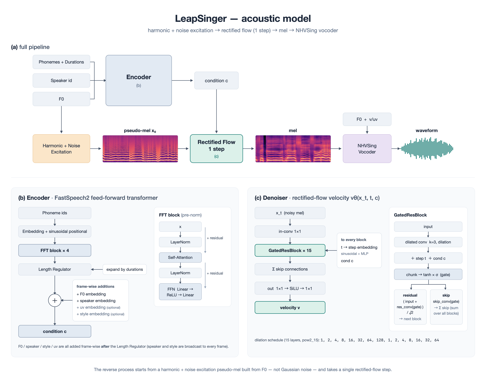
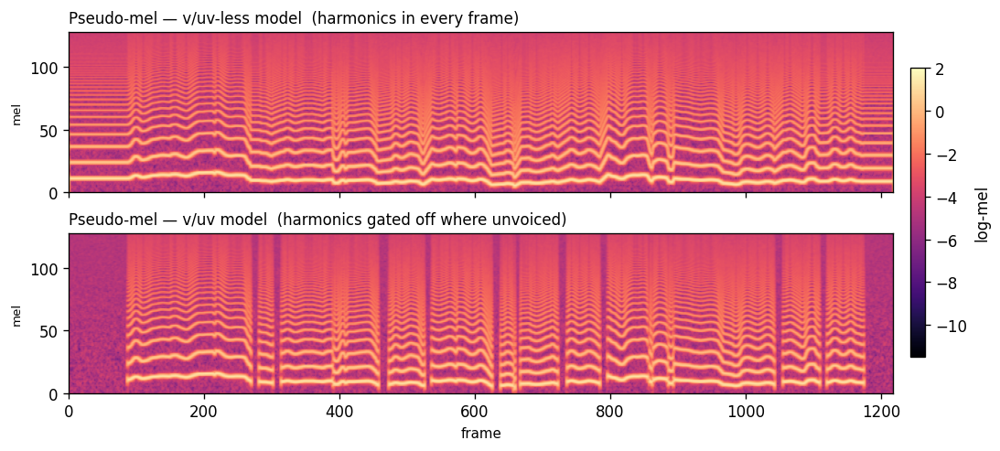

# LeapSinger

**日本語**: [README.md](README.md)

LeapSinger is a diffusion-style **acoustic model** for singing voice. It runs very fast — even on a CPU — and produces stable, clean periodic (harmonic) content. It takes phonemes, their durations, and pitch (F0), and generates a mel-spectrogram. Training needs only audio plus phoneme labels with timing; it does not depend on any particular language. (All of our examples use Japanese data, though.)

**▶ Listen to the demo: https://wavtechyukky.github.io/LeapSinger/demo/**

This repository is meant to be cloned and run directly. It is not published on PyPI.

## What is LeapSinger?

Most diffusion models start from random noise and paint the mel little by little over many steps. LeapSinger instead starts from a **"pseudo-mel" built from F0** (an impulse waveform plus white noise), and finishes the mel in **a single step** with a rectified flow. It skips the slow work of learning how to draw clean periodic content, and jumps straight to a high-quality mel — hence the name *LeapSinger*.

The pseudo-mel differs between the v/uv model and the non-v/uv model. The v/uv model can deliberately produce unvoiced regions.

The non-v/uv model (top) lays harmonics across every frame. The v/uv model (bottom) gates the harmonics off in unvoiced frames (the dark vertical bands are the unvoiced regions).

Through a lot of experiments we found two things: a high-quality neural vocoder for singing is sensitive to the *texture* of the mel, and the hard part for an acoustic model is drawing clean periodic content. LeapSinger starts not from noise but from a pseudo-mel that already has the shape of the pitch, so it avoids the hardest part — learning to draw the periodic content. This design gives:

- **High-quality periodic content** — it draws clean, low-noise periodic content stably. This helps both the texture of the vocoder output and how well each speaker's voice is reproduced.
- **Speed** — there is only one reverse step, so even on a single CPU core the RTF is under 0.03. You *can* use more steps, but going beyond one step actually moves the result *away* from the ground truth.

Other features:

- **Multi-speaker** — switch voices by speaker ID. As an example, we distribute a model with three Japanese singers (Oniku Kurumi / Natsume Yuuri / Namine Ritsu).
- **Style control** — switch singing styles within the same speaker.
- **OpenUTAU export (experimental)** — we provide an export in an OpenUTAU-compatible format. (Sorry — we have not actually verified that it works.)

## Demo

**https://wavtechyukky.github.io/LeapSinger/demo/**

- A three-speaker model, comparing the generated results side by side with GT (the real recordings). Training on a single speaker slightly improves the speaker fidelity of the mel, but we saw no large difference in synthesis quality.
- A style-control demo.

## Performance

RTF (Real-Time Factor) measured on CPU. Smaller is faster; below 1 means faster than real time.

RTF per acoustic model, comparing Python native vs. ONNX across core counts:

| Cores | Python native | ONNX |
|:--:|--:|--:|
| 1 | 0.027 | 0.090 |
| 2 | 0.026 | 0.063 |
| 4 | 0.027 | 0.058 |
| 8 | 0.026 | 0.054 |
| 10 | 0.024 | 0.065 |

- **Python native** is a single step, so it barely depends on core count. Even on one core the RTF is 0.027 (about 37× faster than real time).
- **ONNX** is a few times slower than native because of onnxruntime overhead, but it is still more than 10× faster than real time. 4–8 cores are fastest; using all cores (10) is actually slower.
- **The NHVSing vocoder** runs at RTF under 0.1 on CPU (see the NHVSing repository for details).

(Measured on Apple Silicon, 10 cores, onnxruntime CPU, a ~7-second phrase, median. Results vary by machine.)

The frame settings are 44.1 kHz and hop size 256. Hop size 512 is handled by averaging each pair of adjacent frames.

## Architecture

The flow in the figure above is:

1. **Input** — phonemes, durations, F0 (plus speaker ID if needed).
2. **Encoder** — embed the phonemes, stretch them to frame length according to the durations, and add F0 and speaker to form the condition.
3. **Harmonic + Noise Excitation** — build a "pseudo-mel" from F0 (an impulse waveform plus white noise). This is the starting point of the flow.
4. **Rectified Flow (1 step)** — starting from the pseudo-mel and conditioned on the condition, transform it into a realistic mel in a single step.
5. **NHVSing** — a high-quality neural vocoder that turns the mel into audio (a waveform), at RTF under 0.1 on CPU. https://github.com/wavtechyukky/NHVSing/

The pseudo-mel lets you tune the harmonic decay, the number of harmonics, and the strength of the white noise. That said, after much testing, stacking the impulse's harmonics all the way up to the Nyquist frequency gives the best quality.

## Usage

### Setup

Python 3.13 only (pinned both by `requires-python` in `pyproject.toml` and by `.python-version`). Dependencies and execution go through [uv](https://docs.astral.sh/uv/).

    git clone https://github.com/wavtechyukky/LeapSinger
    cd LeapSinger
    uv sync                               # inference, re-synthesis, notebooks
    uv sync --extra train                 # training (adds TensorBoard)
    uv sync --extra export                # ONNX export
    uv sync --extra train --extra export  # everything

Run Python with `uv run python ...` and add dependencies with `uv add <package>` (do not use bare `python` / `pip`, or `uv pip`). `uv sync` fetches the interpreter named in `.python-version` and builds `.venv/` exactly as resolved in `uv.lock`.

- **PyTorch** is pinned to the CUDA wheel index (cu130) via `[[tool.uv.index]]` in `pyproject.toml`, so `uv sync` alone installs the GPU build on Windows / Linux (the Windows `torch` on PyPI is a CPU build, hence the explicit index). To use a different CUDA, change `cu130` in that url to `cu126` / `cu128` / `cu132` and re-run `uv lock`. On macOS a marker falls back to the CPU/MPS build from PyPI.
- To check the GPU is visible:

      uv run python -c "import torch; print(torch.__version__, torch.cuda.is_available())"
- **F0 extraction (RMVPE)** weights download automatically on first run (HuggingFace → `preprocess/algorithms/rmvpe.pt`).
- **The vocoder (NHVSing)** is bundled as ONNX under `checkpoints/`; no extra download is needed.
- **The acoustic model itself is distributed via Releases** (not included in the repo).

### Configuration

Training and export are driven by YAML (there are examples in `configs/`). A YAML file has six sections: `mel` / `model` / `excitation` / `train` / `gan` / `data`. The main keys are:

- `model` — `spk_dim` (greater than 0 means multi-speaker), `n_speakers`, `n_styles` (greater than 0 enables styles), `use_uv` (whether to feed v/uv as a condition).
- `excitation` — `n_harm` (number of harmonics), `harm_decay` (harmonic decay), `noise_ratio` (white-noise strength).
- `train` — `lr`, `max_updates`, `num_steps` (inference steps; **1** recommended), `balance_speakers` (sample speakers equally), and so on.
- `gan` — settings for the GAN that sharpens texture. `enabled` (`false` = flow loss + mel loss only), `gan_start_step` (the step at which the GAN turns on), `gan_strength` (strength of the adversarial loss), and so on.
- `data` — `spk_map` / `style_map` (mapping from dataset folder name → speaker ID / style ID).

### Building a dictionary

The Japanese phoneme list is in `dict/ja.phonemes` (one phoneme per line, the order is the ID, `pau` at the top is ID 0, and anything after `#` is a comment). To use a different language or your own phonemes, make a file in the same format and pass it to each command with `--phonemes <file>` (if omitted, the Japanese `dict/ja.phonemes` is used).

### Preprocessing

Prepare one YAML per dataset (`configs/recipes/<db>.yaml`). Each song uses an audio `wav` and a `.lab` with phoneme timing (plus a score). The following command produces preprocessed data under `data/<db>/`.

    uv run python -m preprocess.run --recipe configs/recipes/<db>.yaml

The three databases used in the examples can be downloaded with these scripts (please follow each database's terms of use).

    uv run python preprocess/download_scripts/download_oniku.py
    uv run python preprocess/download_scripts/download_natsume.py
    uv run python preprocess/download_scripts/download_ritsu.py

F0 is extracted with RMVPE. (Please do not run RMVPE across multiple processes.)

### Training

Training has two stages. The first stage learns the base voice with a flow loss plus a mel loss; the second stage turns on a GAN to sharpen texture. (This is set in the config's `gan` section; `gan.enabled: false` gives the flow loss plus mel loss only.)

    uv run python -m train --config configs/<name>.yaml \
      --data_dirs data/<db> [data/<db2> ...] \
      --run_name <name> --out_root log --device cuda

Running the same command again automatically resumes from where it stopped.

### Export

    uv run python -m export.cli \
      --ckpt log/<run>/ckpt_050000.pt \
      --out export/<name> --model-name <name> \
      --variant diffsinger --hop 512 --speaker embed

For speaker handling (bake / embed / none) and other details, see "Export to ONNX / OpenUTAU" below.

You can try the whole flow — from export to use — in a notebook. Download the model from the Release and place it in `notebooks/sample_data/` (see `place_model_here.txt` in that folder).

    notebooks/export_and_use_onnx.ipynb

- **Part 1** — a normal ONNX export, running the model on its own (phonemes + duration + F0 → mel → audio).
- **Part 2** — export an OpenUTAU voicebank and explain how it differs from the standalone version.

### Export to ONNX / OpenUTAU (experimental)

`export/` converts a checkpoint into a self-contained ONNX graph. The excitation and the single-step flow are baked into the graph, so the caller only needs to pass phonemes, durations, and F0. For speaker handling, you can choose:

- **bake** — fix a single voice. This makes the simplest graph (no speaker input).
- **embed** — take a speaker vector as input. One graph can switch to any voice.
- **none** — for single-speaker models. No speaker input and no baking (a graph with no notion of speaker). For multi-speaker models, use bake or embed.

For OpenUTAU, it exports a full voicebank (ONNX + config + dictionary + speaker embeddings).

### Vocoder

Two NHVSing vocoders are bundled under `checkpoints/`.

- `nhv_v3.onnx` — takes a hop-size-256 mel and F0.
- `nhv_v3x.onnx` — takes a hop-size-512 mel and F0.

## Options

- **Dictionary** — you can specify any phoneme dictionary. The design can handle languages other than Japanese (multilingual support itself is future work).
- **v/uv handling** — choose between a mode that feeds voiced/unvoiced (v/uv) as a condition, and a mode that uses only a continuous F0 with the gaps filled by linear interpolation.
- **Excitation tuning** — change the harmonic decay, the number of harmonics, and the white-noise strength.
- **Training recipes** — training conditions are set in YAML (which datasets to use, speaker IDs, per-speaker styles and data, and so on).

## Future work

### Experimental SVC development

The `feature/svc` branch is developing an offline singing-voice-conversion model that
drives the existing harmonic excitation and rectified flow from precomputed content
features, F0, V/UV, and loudness. The existing phoneme + duration synthesis path remains
unchanged.

The model, feature-shard contract, training/evaluation wiring, and the dataset
audit/coverage/split tooling are implemented. The content encoder is **ContentVec**
(768-dim layer 12; training uses a fixed random 256-dim subset), F0 is **RMVPE**, and SSL
frames are aligned to the mel grid by **left (hold-previous)**. The extractor that runs ContentVec to build
the feature shard is implemented as well: one command turns a WAV directory into a shard,
bit-identical on re-run. Overfitting a real phrase and producing a WAV has been verified, a **multi-singer base
model over 23 speakers / ~18 hours** has been pretrained for 60,000 steps (content is preserved
for an unseen source singer, measured), and that base has been **fine-tuned to a target singer
for 20,000 steps**. Speaker similarity is now measurable: ECAPA-TDNN on clips of 12 s or longer passes our
pre-registered singing calibration, and it shows the fine-tune does move the voice toward the
target (recovery from the floor rises from 45.1% to 54.9%). **Quality evaluation, the Seed-VC
comparison, and the real-time student are not done yet** -- intelligibility (CER), signal
quality, timing, and inference RTF have no tooling here at all.
The Japanese research suite covering requirements, architecture, data/GPU, training,
evaluation, prior art/licensing, implementation status, and sources is indexed at
[doc/svc.md](doc/svc.md).

- **Multilingual support** — so far we validate with Japanese data, but the design itself is language-independent. We plan to support other languages with their own phoneme dictionaries and data, aiming for a single model that can handle multiple languages.
- **Higher quality** — we think there is still room to improve speaker fidelity, for example by refining how the pseudo-mel is generated and tuning its parameters.
- **Verifying OpenUTAU on real hardware** — the OpenUTAU export is provided, but we have not verified it on an actual OpenUTAU install. We plan to test it for real.

## License

The code is MIT (`LICENSE`). However, the bundled vocoder ONNX files (`checkpoints/nhv_v3*.onnx`), the trained models distributed via Releases, and the singing databases used to train them are **not** covered by MIT — they follow their own licenses and terms of use (see the Acknowledgments below and `CREDITS.txt` in the model release).

**The experimental SVC path is more restricted.** Its base model is trained on **GTSinger (CC BY-NC-SA 4.0 — non-commercial, ShareAlike)**, and whether ShareAlike reaches trained weights is not settled by the license text. **No SVC weights are distributed**: the project decision is research and personal use only (`doc/svc-dataset-ledger.md`). GTSinger's README also forbids generating a specific person's singing voice without their consent, so **converting a voice requires the target singer's consent**, independently of any software license. See the SVC NOTICE in `LICENSE`.

## Acknowledgments

Thanks to the datasets used to train this model, and to the related projects.

- Oniku Kurumi singing database (Oniku Kurumi) — https://onikuru.info/db-download/
- Natsume Yuuri (database production: アマノケイ / voice provider: 霧野蒼太) — https://ksdcm1ng.wixsite.com/njksofficial/enunu-nnsvs
- Namine Ritsu — https://www.canon-voice.com/voicebanks/
- Neural Homomorphic Vocoder — https://www.isca-archive.org/interspeech_2020/liu20_interspeech.html
- dsp (zjlww) — https://github.com/zjlww/dsp

The experimental SVC path additionally uses:

- GTSinger (CC BY-NC-SA 4.0) — https://github.com/AaronZ345/GTSinger
- VocalSet (CC BY 4.0; unseen-source evaluation only) — https://zenodo.org/records/1492453
- ContentVec (MIT) — https://huggingface.co/lengyue233/content-vec-best
- RMVPE — https://arxiv.org/abs/2306.15412 (weights fetched from lj1995/VoiceConversionWebUI; **license not verified**)

The distributed multi-speaker models display the credits above, following each database's terms. For Natsume Yuuri, we display **database production: アマノケイ / voice provider: 霧野蒼太**, and we bundle the "Terms of use for Natsume Yuuri's output audio" with the model distribution.
